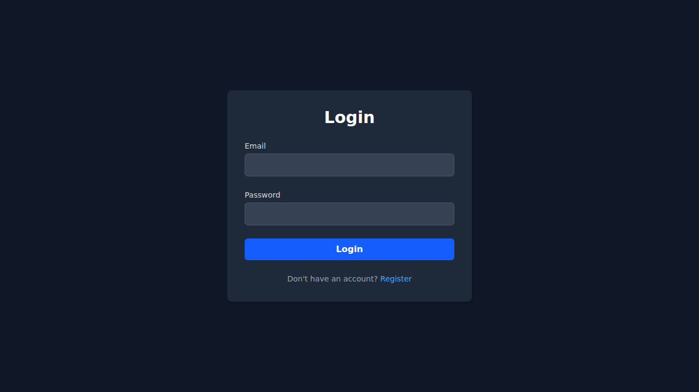

# MicroBlog

Projeto de microblog desenvolvido em Java utilizando Maven.

## Finalidade do Projeto

O **MicroBlog** tem como objetivo oferecer uma plataforma simplificada de microblog, permitindo que usuários publiquem mensagens curtas, visualizem um feed e gerenciem seu conteúdo. A aplicação serve como um exemplo de API web para publicação e leitura de pequenas postagens, ideal para fins de aprendizado, demonstração de arquiteturas Java/Maven ou como ponto de partida para projetos maiores.

## Funcionalidades principais

- **Cadastro e autenticação de usuários:** Suporte para criação de contas de usuário e autenticação para publicação e gerenciamento dos próprios posts.
- **Publicação de postagens:** Permite que usuários publiquem, editem e removam mensagens curtas (posts) no microblog.
- **Feed de postagens:** Visualização de uma linha do tempo (feed) dos posts publicados, organizado de forma cronológica.
- **Gerenciamento de conteúdo:** Possibilidade de editar e excluir postagens próprias.

## Estrutura do Projeto

- `pom.xml`: Arquivo de configuração do Maven, responsável por gerenciar as dependências do projeto.
- `mvnw` e `mvnw.cmd`: Scripts para executar comandos Maven mesmo sem o Maven instalado globalmente.
- Pasta `src/`:
  - `src/main/java`: Código-fonte Java, contendo controladores, serviços e entidades do sistema.
  - `src/main/resources`: Recursos estáticos e configurações.
- Arquivos de configuração `.gitattributes` e `.gitignore`.

## Como realizar a build e executar o projeto

1. **Pré-requisitos:**
   - Java 17 ou superior instalado.
   - (Opcional) Docker para banco de dados, caso necessário.
   - Maven instalado **ou** utilize os scripts `./mvnw` (Linux/Mac) ou `mvnw.cmd` (Windows).

2. **Build do projeto:**

   No terminal, navegue até a raiz do repositório e execute:

   ```bash
   ./mvnw clean install
   ```

   Ou, caso tenha o Maven instalado globalmente:

   ```bash
   mvn clean install
   ```

3. **Execução da aplicação:**

   Uma vez feita a build, execute:

   ```bash
   ./mvnw spring-boot:run
   ```

   Ou com Maven global:

   ```bash
   mvn spring-boot:run
   ```

   A aplicação deverá subir na porta padrão (geralmente 8080).

## Screenshots

| Login                  | Cadastro               | Feed vazio             |
|------------------------|------------------------|------------------------|
|  |  |  |

| Criando post           | Feed com posts         |
|------------------------|------------------------|
|  |  |

## Contribuição

Sinta-se à vontade para abrir issues ou pull requests!

---

[Repositório no GitHub](https://github.com/jurandibs/MicroBlog)
